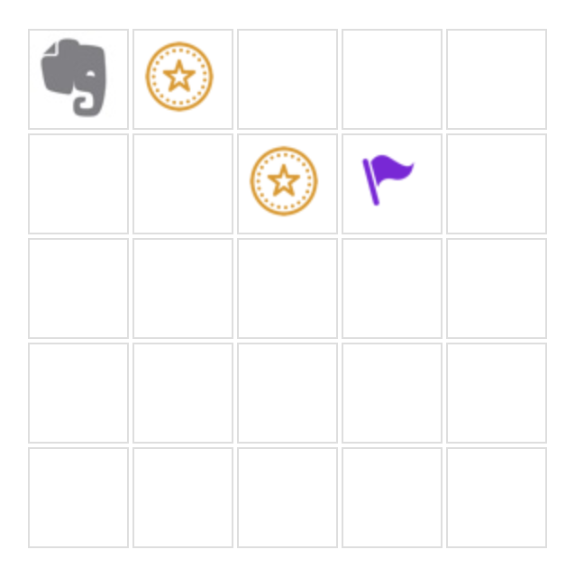

# Lesson 01

- START.html > open this file in your browser to run your code.  
- Inside `START.html` you can edit which level you want to use.  
- Inside the `levels` directory you find a file for each level. You can add your code into these files to solve each level.

## What is a level?

The goal is to direct the elephant to collect all the coins and reach the target (purple flag). Try doing it with using as few commands as possible!

## What commands can I use?

- `move()` - Moves the elephant one field forward in the direction he's facing.
- `turnRight()` - Turns the elephant by 90° to the right.
- `turnLeft()` - Turns the elephant by 90° to the left.
- More to come...

You can use any other javascript code. So feel free to use loops, variables etc.

## Levels
### Level 1
Get to know the commands.

### Level 2
How do loops work?

### Level 3
If statements.

### Level 4
Functions.

### Level 5
Handle random data.