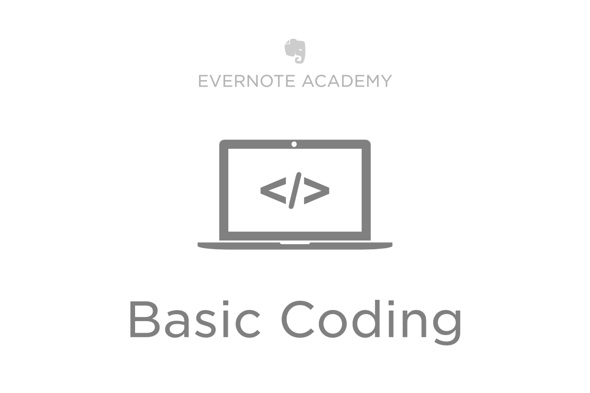

	

A course to teach beginners how to code. This repository contains material for the course, it is NOT the course itself.  
Some material might be interesting though for people trying to do the same, so feel free to contact me.  
  
This is a work in progress.

## Lesson 01

Note / Presentation: [Lesson 01 Note](https://www.evernote.com/shard/s51/nl/1588265527/3cd97ecc-f4a3-4a4f-bc53-742c056cff25/)
  
Let's learn the basics. I've created a little simulator where you can help our elephant collect coins, avoid holes and reach his goal with using real JavaScript. I wanted to have something playfull but still do real coding.